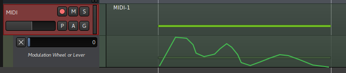

If this is your first time using Larasynth, it is recommended that you read
this entire guide first so you have a good overview of the system before you
use it.

## Overview of Steps

This guide details the following steps:

* Creating training examples
* Creating and configuring a Larasynth project directory
* Recording the examples into Larasynth
* Training Larasynth
* Performing with Larasynth

## Creating Training Examples

The best way to create examples is by using a MIDI sequencer or a digital audio
workstation (DAW). Record or edit some notes in your DAW and then go back and
record or edit controller changes on top of what you played.

### Creating Good Examples

It is important to keep in mind that Larasynth learns to take cues from what
you play on your keyboard, and it cannot read your mind. This may sound
obvious, but it is easy to forget.

For example, if you want your synth to sound one way when when you play a
chromatic line and a different way when you arpeggiate a major chord, there is
no way for Larasynth to figure out which one of these you are about to play
when you strike the first note. When you strike a second note, Larasynth will
know the interval from the first note to the second note, but it still cannot
see farther into the future.

Another thing to keep in mind is that before training you must tell Larasynth
the default value for each of the continuous controllers that you want
Larasynth to control. It is a good idea for each training example to start out
with each continuous controller at its default value, and end with it back at
its default value.

### Start Simple

You may get frustrated if you start by trying to teach Larasynth something
complicated before you have a handle on the basic usage.

Try starting with something very simple, like a single note. Create a
custom envelope by varying the value of one of your synthesizer's parameters
(such as the filter cutoff) over the duration of the note.

Here is a custom envelope that was manually drawn in
[Ardour](https://ardour.org/):



Remember, you will get the best results if the controller value starts and ends
at the default value, which in the above example is 0.

## Creating a Larasynth Project Directory

For each project, Larasynth must store a configuration file, the recorded
training examples, and training results. Each project has all these things
stored within a project directory.

Larasynth can create a directory for your project and create an example
configuration file within that directory.

Let's say you want to create a project directory called
`larasynth_project`. Run the following from the command line:

```
$ lara config larasynth_project
```

You will be prompted to verify that you would like the directory created.

## Recording Training Examples

Currently Larasynth cannot import training examples from MIDI files, it must
record the examples in real time through a MIDI port.

### MIDI Configuration

Before you start recording, you need to edit the `[midi]` section of the file
`larasynth.conf` in your project directory.

The `controllers` parameter is a comma separated list of all the MIDI
continuous controllers you would like Larasynth to control.

The `controller_defaults` parameter is another comma separated list which
specifies the default values for each continuous controller. If you split the
list into pairs, each pair represents a controller number and a default value.

For example, say you want Larasynth to control continuous controllers 1
and 2. Controller 1 should have a default value of 0 and controller 2 should
have a default value of 64. You would configure that like so:

```
controllers = 1, 2
controller_defaults = 1, 0, 2, 64
```

You can split the `controller_defaults` list onto several lines so that it is
easier to read:

```
controller_defaults =
    1, 0,
    2, 64
```

### Recording

Reset the playback in your sequencer to the beginning of your example, and
start Larasynth recording:

```
$ lara record larasynth_project
```

You will be prompted to select an existing MIDI port to record from, or you may
open up a port that your sequencer can connect to.

Once everything is connected, press play in your sequencer. Once playback is
complete, press `ctrl+c` in the terminal that `lara` is running in to stop
recording.

To record another example, run the above command again. Repeat until you have
recorded all your examples.

### Creating Multiple Examples in One Sequencer Track

If you need to create multiple training examples you can record them into the
same track of your MIDI sequencer, with some silence separating them. For the
first training example, start Larasynth recording, press play in your
sequencer, and then pause sequencer playback during the silence between
examples. Shut down Larasynth with `ctrl+c`, start Larasynth recording again,
and resume playback in your sequencer for the next example. Repeat for as many
examples as you need to record.

## Represenation Configuration

You will need to edit the `[representation]` section of `larasynth.conf` before
training.

Larasynth works by passing a representation of what is being played on the
keyboard through a neural network. The output of the network is a
representation of what the continuous controller values should be. Both of
these representatons are configurable.

### Update Rate

The input representation is passed through the network at a regular rate. This
rate is configured in the `update_rate` parameter. This is the number of
updates per second. A faster update rate will allow for more fine-grained
control of the continuous controllers, but it will also make training take
longer and Larasynth will use more of your processor's time during
performance.

The maximum update rate is 100 updates per second (one update every 10
milliseconds). When you play a new note on your keyboard Larasynth will update
immediately to cut down on latency. So if you set your update rate to something
low, like 10, you are **not** subjecting yourself to 100 milliseconds of
added latency.

### Input Features

You must select a subset of the available input representations that Larasynth
is capable of. You can use them all if you want, but it is better to omit any
input features that are not relavent to your training examples so that
Larasynth can learn faster.

Here are the 5 input features available:

* `"some note on"` - This indicates whether or not some note is currently
depressed on your keyboard.
* `"note struck"` - This indicates whether or not a note was struck on the
keyboard since the last update.
* `"note released"` - This indicates whether or not a note was released on the
keyboard since the last update.
* `"velocity"` - If a note was struck on the keyboard since the last update,
this indicates the velocity (loudness) of the note.
* `"interval"` - If a note was struck on the keyboard since the last update,
this indicates the interval between the previous note and the latest note.

### Output Counts

MIDI continuous controller values can range from 0 to 127. Often such a fine
resolution is not necessary. For example, you may have a controller that you
want to be set at 20 some of the time and set at 80 the rest of the time. If
this is the case then you only want Larasynth to have an *output count* of 2
for that controller.

Larasynth figures out what the minimum and the maximum values of a controller
should be based on your training examples. So if controller 1 varies from 20 to
80 over the course of your training examples, it will never set it to a value
outside that range.

The output count determines how many possible values within the range Larasynth
can output. If the range is 20 to 80 and the output count is 2, Larasynth will
only be able to set the controller to 20 or 80. If the output count is 3,
Larasynth will be able to set the controller to 20, 60, or 80. If the output
count is 61, Larasynth will be able to set the controller to any possible value
within that range.

As with `controller_defaults`, the `controller_output_counts` parameter is a
comma separated list of numbers which are interpreted as pairs of controller
numbers and counts.

So if Larasynth is to control controllers 1 and 2, you could configure it like
so:

```
controller_output_counts =
    1, 2,
    2, 10
```

This gives controller 1 an output count of 2, and controller 2 an output count
of 10.

## Training Configuration

Larasynth is trained by creating training sequences from your training
examples. These sequences are passed through the neural network. For each
update in the training sequence the network makes a prediction as to what the
controller values should be and the predicted values are compared to the
desired values. If the network predicts wrong, it is adjusted slightly so that
in the future it is more likely to predict correctly.

Many things about this process are configurable in the `[training]` section of
`larasynth.conf`.

### Silence Padding

When Larasynth assembles your training examples into a training sequence, it
adds a period of silence to the beginning of each example. This is so
that the neural network must use your note events as cues to change the
controller values rather than relying purely on time. It also allows Larasynth
to learn what to do when you are not playing anything.

The amount of silence added is random, and the random values generated come
from a normal distribution. The `mean_padding` parameter specifies the average
number of seconds of silence to add. The `padding_stddev` specifies the
standard deviation.

For example, if you set `mean_padding = 1.0` and `padding_stddev = 0.1`
then on average it will add 1 second of silence padding. The majority of the
time the silence will be between 0.9 and 1.1 seconds, but shorter and longer
periods of silence are possible as well.

If you have a simple training example, such as a custom envelope for a single
note, you may want no silence some of the time. In this case you could set
`mean_padding = 0.1` and `padding_stddev = 0.1` or something similar.

### Repetitions

Each training sequence may contain repetitions of each training example. If you
have 2 training examples and you set `example_repetitions` to 2, then each
training sequence will be created by taking 2 copies of each training example
to create 4 examples, and then shuffling these 4 examples to create an ordering
for the sequence.

Every so often during training there will be a *validation sequence* presented
to the network. During validation the network will not be changed at all, the
trainer is simply assessing how accurate the network is in its current state.

The number of repetitions during validation is configured separately in the
`validation_example_repetitions` parameter. This value should generally be
greater than or equal to `example_repetitions`.

### Varying the Tempo

When you are performing you will not strike and release notes with precisely
the same timing as they were struck and released in the training examples due
to human limitations. Thus Larasynth may need to learn to tolerate variations
in overall tempo and minor fluctuations in tempo from note to note. This is
accomplished by applying random timing variations to each distinct training
sequence.

The `tempo_adjustment_factor` parameter specifies how widely the overall tempo
may vary from sequence to sequence. The `tempo_jitter_factor` specifies
how widely the amount of time may vary note to note.

For both of these parameters, keep the value at `0.0` if you do not want any
tempo adjustments during training. The maximum value for both is `1.0`. This
will vary the tempo to up to twice as fast or twice as slow as the original
tempo.

For single-note training examples it is appropriate to keep both of these
values at `0.0`.

### Resetting Training Sequences

If Larasynth is being trained with a training sequence and its predictions are
currently very inaccurate, it is usually not productive to continue with that
training sequence. Instead, the sequence should be abandoned early on when it
is clear that its predictions are going to be consistently inaccurate.

However, you may have created training examples with small inconsistencies that
Larasynth will not be able to learn *exactly* but it should be able to be
"close enough". If that is the case, you want Larasynth to continue training on
a training sequence if there are minor errors or just a small streak of errors.

After each update within a training sequence, the *squared error* of the
controller value predictions is calculated. If the target value for a
controller was 53 and the network predicted it should be 51, that is an error
of -2, and a squared error of 4. The `squared_error_failure_tolerance`
parameter defines a maximum value for the sum of the squared errors at which a
prediction can still be considered correct.

For example, if Larasynth is controlling 2 different controllers and
`squared_error_failure_tolerance` is set to 5, then it will allow one
controller to be off by 1 (squared error of 1) and the other controller to be
off by 2 (squared error of 4) since the sum of the squared errors
is 5. However, it will not allow both controllers to be off by 2, since the sum
of the squared errors would be 8.

The `consecutive_failures_for_reset` parameter specifies how many times in a
row the network's prediction must be wrong outside of the failure tolerance
before it resets the training sequence.

The `reset_probability` parameter specifies the probability that the sequence
will actually be reset if the above reset conditions are met. If this value
is 1.0 then the sequence will always be reset when the reset conditions are
met. If the value is 0.0, the sequence will never reset (not advised). Setting
it somewhere in the middle will occasionally allow the sequence to continue a
little longer before resetting.

### Training Epochs

Each presentation of a training sequence is called a *training epoch*.

The `epoch_count_before_validating` parameter specifies the number of epochs to
wait before presenting a validation sequence. Validation will also occur when
the network gets more consecutive predictions correct in a row than ever
before.

When a validation sequence is presented, the mean (average) of the squared
errors from each update is calculated. The mean squared error (MSE) is used to
determine how well the network is trained. An MSE of 0.0 means that the network
has learned to reproduce your training examples perfectly.

The `mse_threshold` parameter defines a MSE level that is "good enough." If the
MSE is at this level or lower after validation, training will stop.

The `max_epoch_count` parameter specifies the maximum number of training epochs
that will be performed before training shuts down.

## Training

Once the configuration parameters have been set, you can start training like
so:

```
$ lara train larasynth_project
```

Training will continue until any of these conditions are met:

* The MSE threshold is hit
* The maximum number of training epochs has been performed
* You press `ctrl+c` in the terminal running Larasynth

### How Long will Training Take?

This question is impossible to answer as it depends on many factors including
the speed of your computer, the complexity of your training examples, how you
have configured Larasynth, and whether or not it is even possible for Larasynth
to learn what you want to teach it.

I have achieved 0.0 MSE in less than a minute for simple training examples, in
several hours for more complex training examples, and I have had training go on
for days without success.

If you are not having success, first you must think about your training
examples. Do they contradict each other? Do the controller changes "react" to
distinct note events, or are you trying to get Larasynth to "read your mind"?
Can you express what you want Larasynth to learn in simpler terms?

If you think Larasynth should be able to learn from your examples, then you can
start tweaking the training parameters.

Also remember that you do not always need to achieve an MSE of 0.0 in order to
have a sufficiently well trained network. If you think the MSE might be low
enough, try performing with it and see what happens.

Each time you train, the best result will be saved. None of your past results
will be overwritten, so you can feel free to train as many times as you like to
try to achieve a better result. You may also want to train multiple networks
simultaneously, as one might achieve successful results faster than another.

## Performing

Once you have a trained network, you can use it to perform.

Call `lara` like so:

```
$ lara perform larasynth_project
```

You will be presented with a list of training results, including the MSEs that
were achieved for each. Choose a training result to pick a network.

Next, MIDI ports will be set up. If you specified valid ports in the
configuration, they will be connected now. Otherwise you will be prompted to
pick ports or to open ports that other applications can connect to.

Once you have hooked your keyboard and your synth up via MIDI, you may now
play notes on your keyboard and hopefully Larasynth will adjust the continuous
controllers to your liking.

Press `ctrl+c` to shut Larasynth down.
