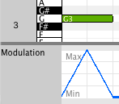

# Larasynth Tutorial

This tutorial will show you how to create a simple Larasynth project and to
train a neural network that will adjust a MIDI parameter for you. Once you
finish the tutorial, head over to the [topic guide](topics.md) for a more
complete discussion about using Larasynth.

## Prerequisites

This tutorial assumes the following:

* You have installed Larasynth
* You have installed a software synthesizer with MIDI support (such as
[Helm](http://tytel.org/helm/)) or you have a hardware synthesizer connected to
your computer via MIDI
* You have a MIDI keyboard connected to your computer

For this tutorial project, Larasynth will control MIDI continuous controller
number 1, which is usually mapped to the modulation wheel. The behavior will be
very simple - when you play a note, the value of controller 1 will be adjusted
from 0 up to 127 (its maximum value) and then back down to 0.

## Project Organization

It is a good idea to put all your Larasynth projects somewhere where you can
easily access them. Open up a terminal, create a directory for Larasynth, and
navigate to that directory.

For example, here's how you would create and navigate to a directory called
`larasynth` within your `Documents` directory:

```nohighlight
$ mkdir Documents/larasynth
$ cd Documents/larasynth
```

## Creating a Project Directory

Every Larasynth project lives in a *project directory*. You can create a
project directory from the command line using the `config` action. Create
a project named `tutorial` by running the following command:

```nohighlight
$ lara tutorial config
```

You should see the following output. You will need to provide confirmation for
the directory to be created for you:

```nohighlight
tutorial does not exist.
Create it now? (Y/n) y
Created tutorial
Wrote tutorial/larasynth.conf
Edit this file to finish setting up the configuration.
```

Note the command that was run: `lara tutorial config`. Every `lara` command
takes at least 2 arguments: the path to the project directory, and the action
to perform. In this case our project directory is named `tutorial` and the
action we want to perform is `config`, which creates the project directory and
a configuration file.

Try listing the contents of the `tutorial` directory:

```nohighlight
$ ls tutorial
larasynth.conf
```

So far the project directory only contains one item, `larasynth.conf`. You will
need to edit this file to configure your project.

## Editing `larasynth.conf`

Now you need to edit `larasynth.conf`. Any plain text editor will work. Open up
`larasynth.conf` in your editor of choice.

A `larasynth.conf` file contains values for many parameters which affect
Larasynth's behavior. The parameters are organized into several sections.

### The `[midi]` Section

The first section you want to edit is the the `[midi]` section, which is the
first section in the file. You should see this:

```nohighlight
[midi]
# Which controllers to control
controllers = 1, 2

# Default controller values are also specified as a comma separated list. Here
# controller 1 defaults to 0 and controller 2 defaults to 127
controller_defaults =
   1, 0,
   2, 127
```

For this tutorial you only want to control controller number 1 (which is
usually mapped to the modulation wheel). Edit these two parameters so that
Larasynth will only control parameter 1 and it has a default value of 0. I
removed the comments so that the text is more compact:

```nohighlight
[midi]
controllers = 1
controller_defaults =
   1, 0
```

You can leave the MIDI port parameters commented out for now.

### The `[representation]` Section

The next section to edit is the `[representation]` section. These parameters
let you set how the controller values are represented, how ofen Larasynth
should update the controller values, and what features from the state of the
keyboard should be passed to Larasynth.

#### Output Counts

The first parameter is `controller_output_counts`. This controls the resolution
of the continuous controller values. For this tutorial, set the output count
to 8. This means that the controller will be allowed to vary from 0 to 127, but
at any given time it will only be able to have one of the following 8 values:
0, 18, 36, 54, 73, 91, 109, or 127.

#### Update Rate

The `update_rate` parameter specifies how often the parameter values will be
re-calculated and potentially updated. By default this value is 75, which means
75 updates per second or approximately one update every 13 milliseconds. This
is more frequent than we need for this example, so change the value of
`update_rate` to 20.

#### Input Features

Here is the default `input_features` list:

```nohighlight
input_features =
     "some note on",     # any note is currently playing
     "note struck",      # a note has just been struck
     "note released",    # a note has just been released
     "velocity",         # the velocity of the note that was just struck
     "interval"          # the interval between the last two struck notes
```

Each of these features provides additional information about the current state
of the keyboard to the neural network. For this example project, all the
network needs to care about is whether or not a note is currently being played,
so the only input feature we need is `"some note on"`. Remove the other
features from the list, and be sure to remove the trailing comma after `"some
note on"`.

Now you should have a `[representation]` section that looks like this (with
comments removed):

```nohighlight
[representation]
controller_output_counts =
   1, 8

update_rate = 20

input_features =
     "some note on"
```

For future projects you may want to adjust the parameters in the `[training]`
section, but for this tutorial project the default values should work fine.

## Importing a Training Example

Now you need to provide a training example that Larasynth can learn from. This
can be in the form of a MIDI file, or you can record MIDI events into Larasynth
through a MIDI port. For this tutorial, a MIDI file is provided for you.

This MIDI file is extremely simple. It consists of a single note, and control
change events which change the value of continuous controller 1 over the
duration of the note. This is what it looks like in the open source MIDI editor
[Aria Maestosa](http://ariamaestosa.sourceforge.net/):



Download the MIDI file [here](midi/larasynth_tutorial.mid). You may save it to
wherever you like, but you will need to know where it is so that you may
specify its location to Larasynth.

Now you can import the MIDI file as a training example using Larasynth's
`import` action. Assuming you saved the MIDI file into your `Downloads` folder,
run the following command:

```nohighlight
$ lara tutorial import ~/Downloads/larasynth_tutorial.mid
```

If all goes well, the output should look something like this:

```nohighlight
Read events from 2 tracks in /home/username/Downloads/larasynth_tutorial.mid:
  1 notes
  252 controller events
Wrote 254 events to tutorial/training_examples/example-2017-05-26-17:23:11.611898.seq
```

The note and controller events are in 2 different tracks in the MIDI
file. Larasynth will always merge all of the tracks of a MIDI file into a
single training example.

## Training

Now that you have imported the MIDI file as a training example you are ready to
train!

Run the following command:

```nohighlight
$ lara tutorial train
```

You should see output that looks something like this:

```nohighlight
Training LSTM network.

Network configuration:

Block counts: 43
Learning rate: 0.05
Momentum:      0.8

Training configuration:

Max epochs:    3000
MSE threshold: 0
Epochs before validating: 100
Backpropagate if correct: 0
Reset probability: 0.5
Consecutive failures for reset: 5
Squared error failure tolerance: 8

Representation configuration:

Controller output counts:
  1: 8
Update rate: 20
Input features:
  some note on

Validating after epoch 1
MSE: 1828.29
New best MSE
Validating after epoch 2
MSE: 3296.42
Validating after epoch 88
MSE: 7168.7
Validating after epoch 100
MSE: 2663.65
Validating after epoch 160
MSE: 2610.97
Validating after epoch 185
MSE: 1750.25
New best MSE
Validating after epoch 195
MSE: 1514.7
New best MSE
Validating after epoch 200
MSE: 1456.44
New best MSE
Validating after epoch 218
MSE: 1246.76
New best MSE
Validating after epoch 244
MSE: 416.796
New best MSE
Validating after epoch 245
MSE: 1159.49
Validating after epoch 248
MSE: 1029.46
Validating after epoch 263
MSE: 441.089
Validating after epoch 293
MSE: 0
New best MSE
MSE threshold hit after 293 epochs

Writing results to tutorial/training_results/results-2017-05-26-17:31:43.194222.json
```

Since the neural network is randomly intitialized, the number of training
epochs will vary from run to run.

The network is trying to minimize the mean squared error (MSE) of its
predictions during each training epoch. Achieving an MSE of 0 means that the
network was able to to learn to perfectly reproduce the control change events
from the training example.

Since this is such a straightforward example, you should be able to hit an MSE
of 0 each time you train with this example. When you create more complicated
examples it may be difficult or impossible for the network to learn to
reproduce the output perfectly. In those cases training will stop after a
certain number of training epochs or when the MSE is below a certain
threshold. You can configure these values in the project configuration file.

## Performing

Now that you have a trained network, you can use Larasynth to perform!

Start your software synthesizer (or connect your hardware synthesizer to your
computer) and connect your MIDI keyboard. Make sure that the keyboard is *not*
currently set up to send events to the synthesizer. Once Larasynth is running
in performance mode, MIDI events from the keyboard will be sent to Larasynth,
and Larasynth will forward them on to the synthesizer.

Run the following command:

```nohighlight
$ lara tutorial perform -v
```

The `-v` option indicates that you would like *verbose* output, which means
a message will be printed each time a MIDI event is sent to the
synthesizer. This is nice for making sure everything is working correctly but
it can add latency to the system.

You will first be prompted to select a trained network from the training
results:

```nohighlight
Pick from the following training results:
  1: MSE: 0 - results-2017-05-26-17:31:43.194222.json
  q: quit
Enter your choice: 1
```

Next you will be prompted to select a port for output. If your synthesizer
opens a port for devices to connect to, it should show up in this list. If not,
you will need to open a port for the synthesizer to connect to:

```nohighlight
Select a MIDI port to send to:
  0: Open a port for other devices to connect to
  q: quit
Enter your choice [q]: 0

Opened port "larasynth output" for other devices to connect to
```

Now select a port for input. Here we we are using MidiKeys, a software MIDI
keyboard:

```nohighlight
Select a MIDI port port to receive from:
  1: MidiKeys
  2: larasynth output
  0: Open a port for other devices to connect to
  q: quit
Enter your choice [q]: 1

Receiving from port "MidiKeys"

Performing with an update interval of 50000 microseconds
```

Larasynth is now running in performance mode. If you opened ports for other
devices to connect to, connect those devices now. You should now be able to
play notes and Larasynth will adjust controller 1:

```nohighlight
note 60 on
set controller 1 to 18
set controller 1 to 36
set controller 1 to 54
set controller 1 to 73
set controller 1 to 91
set controller 1 to 109
set controller 1 to 127
set controller 1 to 109
set controller 1 to 91
set controller 1 to 73
set controller 1 to 54
set controller 1 to 36
set controller 1 to 18
set controller 1 to 0
note 60 off
```

Note that for this example, controller 1 will be reset to 0 when a note is
released, but if a note is held continually then controller 1 will continue to
oscillate up and down.

## Beyond This Tutorial

From here the possibilities are endless! Please see the
[topic guide](topics.md) for a more detailed guide to creating good training
examples and using Larasynth's features.
